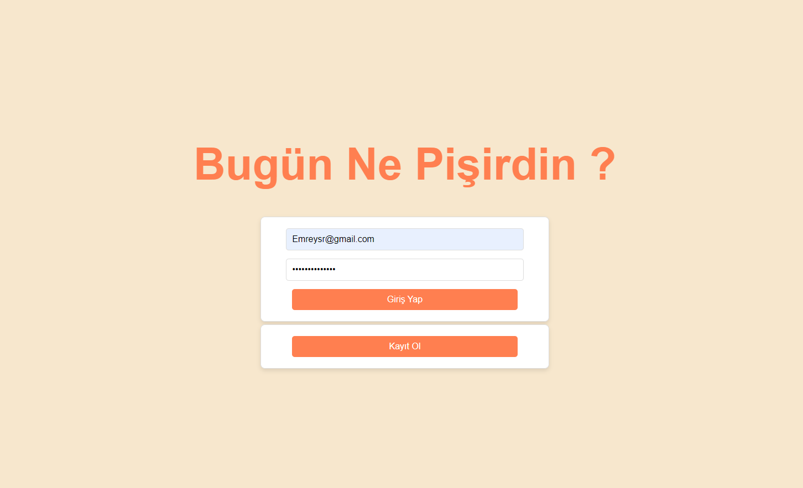
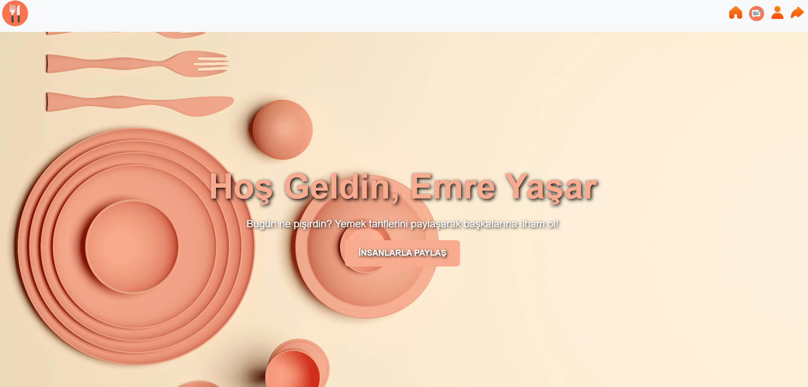
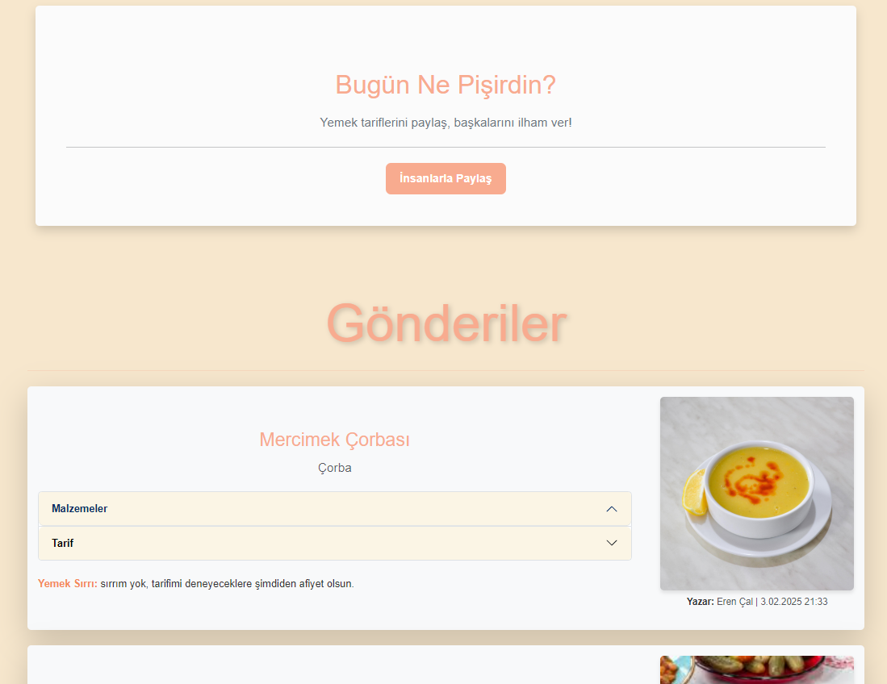
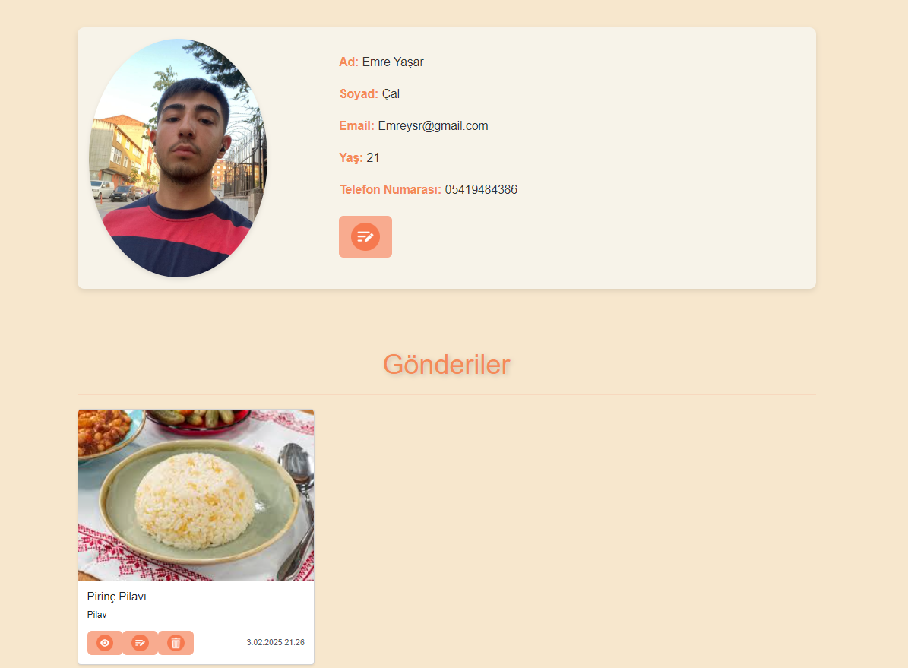

<h1 align="center">Bugun Ne Pisirdin?</h1>


<div align="center"> 
<h3 align="center">**What's on Your Menu Today?**</h3>
<div>
<table>
  <tr>
    <td></td>
    <td></td>
  </tr>
  <tr>
    <td> </td>
    <td></td>
  </tr>
</table>


[**Explore the Docs »**](https://github.com/Emreysrcl/Bugun-Ne-Pisirdin)

[**Try Bugun Ne Pisirdin Now »**](https://bugun-ne-pisirdin-production.up.railway.app)

</div>

---

## **About The Project**

**Bugun Ne Pisirdin** is a web application that allows users to share their daily meals, explore recipes, and interact with other food enthusiasts. Users can upload photos of their meals, add descriptions, and browse meals shared by others.

---

## **Key Features**

✅ **User Registration & Login** – Secure authentication system for user profiles.  
✅ **Post a Meal** – Share your daily meal with a photo and description.  
✅ **Browse & Search** – Discover new meals from different users.  
✅ **Responsive Design** – Optimized for desktop and mobile devices.  
✅ **Image Uploading** – Users can upload meal images directly.  

---

## **Built With**

- [Node.js & Express.js](https://nodejs.org/en) - Backend framework  
- [EJS](https://ejs.co) - Template engine for dynamic content  
- [PostgreSQL](https://www.postgresql.org) - Database for storing user data and meals  
- [Bootstrap](https://getbootstrap.com) - Styling and responsive design  
- [Multer](https://github.com/expressjs/multer) - Handling image uploads  
- [CSS](https://www.w3schools.com/css/) - Additional styling  

---

## **Getting Started**

### **Prerequisites**
Ensure you have the following installed:
- [Node.js](https://nodejs.org/)
- [PostgreSQL](https://www.postgresql.org/)
- [Git](https://git-scm.com/)

### **Installation**

 **Clone the repository:**
   ```sh
   git clone https://github.com/Emreysrcl/Bugun-Ne-Pisirdin.git
   ```
 **Navigate to the project directory:**
   ```sh
   cd Bugun-Ne-Pisirdin
   ```
 **Install dependencies:**
   ```sh
   npm install
   ```
 **Set up the database:**
   - Create a PostgreSQL database.
   - Run the provided SQL scripts in `queries.sql` to set up the necessary tables.
 **Configure environment variables:**
   - Create a `.env` file in the root directory.
   - Add the required variables (e.g., database connection string, secret keys).
 **Start the server:**
   ```sh
   npm start
   ```
   *Server will run on http://localhost:3000*

---

## **Usage**

 **Sign up/Login** – Create an account to start sharing your meals.
 **Post a Meal** – Upload a picture and write about what you cooked today.
 **Explore** – Browse through meals shared by other users.


---

## **Contributing**

Contributions are welcome! Feel free to fork the repository, make changes, and submit a pull request.

---

## **License**

Distributed under the MIT License. See [MIT License](https://opensource.org/licenses/MIT) for more details.

---

## **Contact**

👤 **Emre Yaşar Çal**  
- **X:** [@Zaytexss](https://twitter.com/Zaytexss)  
- **Email:** 2003ysr@gmail.com  
- **LinkedIn:** [Emre Yaşar Çal](https://www.linkedin.com/in/emre-ya%C5%9Far-%C3%A7al-3562ab203/)  
- **Instagram:** [@emreysrcl](https://www.instagram.com/emreysrcl/?hl=tr)  

**Project Link:** [Bugun Ne Pisirdin](https://github.com/Emreysrcl/Bugun-Ne-Pisirdin)

---

## **Acknowledgments**

Shoutout to the amazing tools and resources used in this project:

- [Bootstrap](https://getbootstrap.com) – For responsive UI design
- [Multer](https://github.com/expressjs/multer) – For handling image uploads
- [PostgreSQL](https://www.postgresql.org/) – Database management
- [Node.js & Express](https://nodejs.org/en) – Backend framework

---

_Enjoy sharing your meals and discovering new recipes with **Bugun Ne Pisirdin!**_ 🍽️
